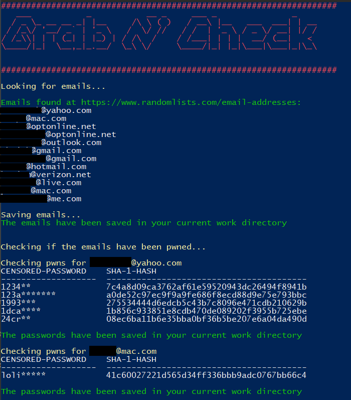
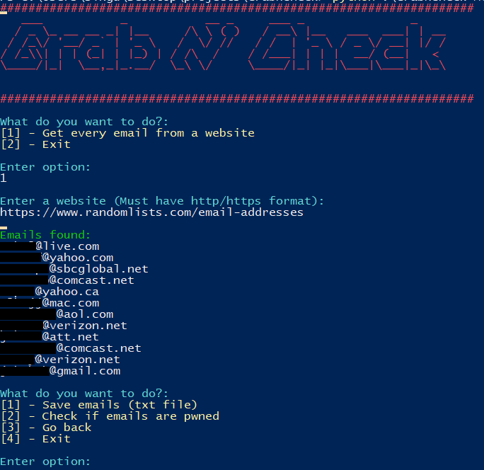

# GrabNCheck
GrabNCheck is a python program that scraps emails from a given website and check if those emails have been pwned. It uses https://breachdirectory.tk/ database to check if the passwords have been leaked. No API key is needed.

This program uses selenium ChromeDriver so don't forget to add your ChromeDriver path to the file (line 11):

```CHROME_WEBDRIVER_PATH = r'C:\webdrivers\chromedriver'```

## **Usage**

For the GrabNCheck-CLI.py version run the following command on the console:

```python GrabNCheck-CLI.py -u/--url WEBSITE```



For the GrabNCheck-Menu.py just run the following command:

```python GrabNCheck-CLI.py```



## **Requeriments**

Install the requeriments.txt to run the program with no problems.

* appdirs==1.4.4
* beautifulsoup4==4.9.3
* bs4==0.0.1
* certifi==2020.12.5
* chardet==4.0.0
* cssselect==1.1.0
* fake-useragent==0.1.11
* idna==2.10
* lxml==4.6.3
* parse==1.19.0
* pyee==8.1.0
* pyfiglet==0.8.post1
* pyppeteer==0.2.5
* pyquery==1.4.3
* requests==2.25.1
* requests-html==0.10.0
* selenium==3.141.0
* six==1.16.0
* soupsieve==2.2.1
* tabulate==0.8.9
* tqdm==4.60.0
* urllib3==1.26.4
* w3lib==1.22.0
* websockets==8.1

## **To do**

* Update it to use scylla.so database once they release the new website.
* Add directory brute forcing
